# Chess System Low-Level Design (LLD)

This directory contains a low-level design (LLD) implementation of a multiplayer Chess system, written in C++. The design utilizes multiple object-oriented design patterns to create a clean, modular, and extensible architecture. It includes standard chess rule validation (check, checkmate, stalemate), score-based matchmaking, real-time in-game chat mediation, and board visualization.

## Core Features

- **Standard Chess Pieces & Movement**: Complete implementation of movement calculations for all six Chess pieces (`King`, `Queen`, `Rook`, `Bishop`, `Knight`, `Pawn`) including double pawn push.
- **Rule Verification**: A modular `ChessRules` subsystem validates moves, simulates moves to check for self-check vulnerability, and determines end-game states (`checkmate` and `stalemate`).
- **Score-Based Matchmaking**: The `GameManager` supports matchmaking using a pluggable strategy (`ScoreBasedMatching`) to match waiting players with similar scores.
- **In-Game Chat System**: Players can exchange text messages inside a match, facilitated by a Mediator-based communications pipeline.
- **Game Lifecycle Management**: Handles player turns, score increments (+30 for a win, -20 for a loss, -50 penalty for quitting), and match cleanup.
- **ASCII Board Visualizer**: Outputs a clear, well-formatted ASCII representation of the board after each move.

---

## Design Patterns Used

1. **Strategy Pattern**:
   - **Piece Movement**: `Piece` defines the interface, and each specific piece (`King`, `Queen`, etc.) implements its own algorithm for calculating all hypothetically possible moves.
   - **Game Rules**: `ChessRules` defines the interface for rule validation, allowing standard rules (`StandardChessRules`) or alternative formats (e.g., Chess960, Blitz-specific rules) to be swapped in.
   - **Matchmaking Strategy**: `MatchingStrategy` encapsulates matchmaking algorithms, allowing different matching heuristics (e.g., score-based tolerance, geographical distance, queue-time bounds) to be plugged in dynamically.

2. **Factory Method Pattern**:
   - `PieceFactory` instantiates the appropriate concrete subclass of `Piece` based on `PieceType` and `Color`.

3. **Mediator Pattern**:
   - `ChatMediator` (interface) and `Match` (concrete mediator) coordinate communication between players during a match. The `User` subclasses `Colleague` and uses the mediator to broadcast messages to the opponent without direct coupling.

4. **Singleton Pattern**:
   - `GameManager` maintains global registries of active matches, waiting queues, and the active matchmaking strategy. It is accessed via a thread-safe-ready static pointer interface.

---

## Class Diagram Overview

### UML Diagram Reference
For a visual view of the relationships and classes, check out the [Chess UML Diagram](./ChessUML.png).

### Mermaid Class Diagram

```mermaid
classDiagram
    class Color {
        <<enumeration>>
        WHITE
        BLACK
    }
    
    class PieceType {
        <<enumeration>>
        KING
        QUEEN
        ROOK
        BISHOP
        KNIGHT
        PAWN
    }
    
    class GameStatus {
        <<enumeration>>
        WAITING
        IN_PROGRESS
        COMPLETED
        ABORTED
    }
    
    class Position {
        -row: int
        -col: int
        +Position()
        +Position(r: int, c: int)
        +getRow() int
        +getCol() int
        +isValid() bool
        +toString() string
        +toChessNotation() string
    }
    
    class Move {
        -from: Position
        -to: Position
        -piece: Piece*
        -capturedPiece: Piece*
        +Move(from: Position, to: Position, piece: Piece*, captured: Piece*)
        +getFrom() Position
        +getTo() Position
        +getPiece() Piece*
        +getCapturedPiece() Piece*
    }
    Move o-- Position
    Move o-- Piece
    
    class Piece {
        <<abstract>>
        #color: Color
        #type: PieceType
        #hasMoved: bool
        +Piece(c: Color, t: PieceType)
        +getColor() Color
        +getType() PieceType
        +getHasMoved() bool
        +setMoved(moved: bool) void
        +getPossibleMoves(currentPos: Position, board: Board*)* vector~Position~
        +getSymbol()* string
        +toString() string
    }
    Piece o-- Color
    Piece o-- PieceType
    
    class King {
        +getPossibleMoves(currentPos: Position, board: Board*) vector~Position~
        +getSymbol() string
    }
    class Queen {
        +getPossibleMoves(currentPos: Position, board: Board*) vector~Position~
        +getSymbol() string
    }
    class Rook {
        +getPossibleMoves(currentPos: Position, board: Board*) vector~Position~
        +getSymbol() string
    }
    class Bishop {
        +getPossibleMoves(currentPos: Position, board: Board*) vector~Position~
        +getSymbol() string
    }
    class Knight {
        +getPossibleMoves(currentPos: Position, board: Board*) vector~Position~
        +getSymbol() string
    }
    class Pawn {
        +getPossibleMoves(currentPos: Position, board: Board*) vector~Position~
        +getSymbol() string
    }
    
    Piece <|-- King
    Piece <|-- Queen
    Piece <|-- Rook
    Piece <|-- Bishop
    Piece <|-- Knight
    Piece <|-- Pawn
    
    class PieceFactory {
        +createPiece(type: PieceType, color: Color)$ Piece*
    }
    PieceFactory ..> Piece : Creates
    
    class Board {
        -board: Piece*[8][8]
        -piecePositions: map~Position, Piece*~
        +Board()
        +initializeBoard() void
        +placePiece(pos: Position, piece: Piece*) void
        +removePiece(pos: Position) void
        +getPiece(pos: Position) Piece*
        +isOccupied(pos: Position) bool
        +isOccupiedBySameColor(pos: Position, color: Color) bool
        +movePiece(from: Position, to: Position) void
        +findKing(color: Color) Position
        +getAllPiecesOfColor(color: Color) vector~Position~
        +display() void
    }
    Board o-- Piece
    Board o-- Position
    
    class ChessRules {
        <<abstract>>
        +isValidMove(move: Move, board: Board*)* bool
        +isInCheck(color: Color, board: Board*)* bool
        +isCheckmate(color: Color, board: Board*)* bool
        +isStalemate(color: Color, board: Board*)* bool
        +wouldMoveCauseCheck(move: Move, board: Board*, kingColor: Color)* bool
    }
    
    class StandardChessRules {
        +isValidMove(move: Move, board: Board*) bool
        +isInCheck(color: Color, board: Board*) bool
        +isCheckmate(color: Color, board: Board*) bool
        +isStalemate(color: Color, board: Board*) bool
        +wouldMoveCauseCheck(move: Move, board: Board*, kingColor: Color) bool
    }
    ChessRules <|-- StandardChessRules
    
    class Message {
        -senderId: string
        -content: string
        -timestamp: time_t
        +Message(sender: string, content: string)
        +getSenderId() string
        +getContent() string
        +toString() string
    }
    
    class ChatMediator {
        <<interface>>
        +sendMessage(message: Message*, user: User*)* void
        +addUser(user: User*)* void
        +removeUser(user: User*)* void
    }
    
    class Colleague {
        <<abstract>>
        #mediator: ChatMediator*
        +setMediator(med: ChatMediator*) void
        +send(message: Message*)* void
        +receive(message: Message*)* void
    }
    Colleague o-- ChatMediator
    
    class User {
        -id: string
        -name: string
        -score: int
        +User(id: string, name: string)
        +getId() string
        +getName() string
        +getScore() int
        +incrementScore(pts: int) void
        +decrementScore(pts: int) void
        +send(message: Message*) void
        +receive(message: Message*) void
    }
    Colleague <|-- User
    
    class Match {
        -matchId: string
        -whitePlayer: User*
        -blackPlayer: User*
        -board: Board*
        -rules: ChessRules*
        -currentTurn: Color
        -status: GameStatus
        -moveHistory: vector~Move~
        -chatHistory: vector~Message*~
        +Match(id: string, white: User*, black: User*)
        +makeMove(from: Position, to: Position, player: User*) bool
        +quitGame(player: User*) void
        +endGame(winner: User*, reason: string) void
    }
    ChatMediator <|-- Match
    Match o-- User
    Match *-- Board
    Match *-- ChessRules
    Match *-- Move
    Match *-- Message
    
    class MatchingStrategy {
        <<abstract>>
        +findMatch(user: User*, waitingUsers: vector~User*~&)* User*
    }
    
    class ScoreBasedMatching {
        -scoreTolerance: int
        +ScoreBasedMatching(tolerance: int)
        +findMatch(user: User*, waitingUsers: vector~User*~&) User*
    }
    MatchingStrategy <|-- ScoreBasedMatching
    
    class GameManager {
        -activeMatches: map~string, Match*~
        -waitingUsers: vector~User*~
        -matchingStrategy: MatchingStrategy*
        -matchCounter: int
        -instance: GameManager*$
        -GameManager()
        +getInstance()$ GameManager*
        +requestMatch(user: User*) void
        +makeMove(matchId: string, from: Position, to: Position, player: User*) void
        +quitMatch(matchId: string, player: User*) void
        +sendChatMessage(matchId: string, message: string, user: User*) void
        +displayActiveMatches() void
    }
    GameManager o-- Match
    GameManager o-- User
    GameManager o-- MatchingStrategy
```



---

## How to Run

To compile and run this implementation:

```bash
# Navigate to the ChessDesignPattern folder
cd ChessDesignPattern

# Compile the C++ code
g++ -std=c++17 code.cpp -o chess_design

# Run the executable
./chess_design
```

---

## Example Walkthrough Output

When executed, the program runs a demonstration of a Scholar's Mate (4-move checkmate):

1. **Players**: Aditya (Score: 1000) vs Rohit (Score: 1000).
2. **Move 1**: White pawn moves `e2-e4`. Black pawn moves `e7-e5`.
3. **Move 2**: White Bishop moves `f1-c4` (targeting `f7`). Black Knight develops to `c6`.
4. **Move 3**: White Queen moves `d1-h5` (attacking `f7` and `h7`). Black Knight defends `h7` via `g8-f6`, but exposes the weak `f7` pawn.
5. **Move 4**: White Queen captures on `f7` (`Qh5xf7#`), resulting in **Checkmate**.
6. **Chat Messages**: Players exchange concluding messages ("Good game!", "Thanks, that was a quick one!") using the Mediator chat pipeline.
7. **Matchmaking Demo**: A separate queue registers Saurav, Manish, and Abhishek, pairing Saurav and Manish who are within score tolerance, and keeping Abhishek in the waiting list.

```text
=== Chess System with Design Patterns Demo ===

=== Scholar's Mate Demo (4-move checkmate) ===
Match started between Aditya (White) and Rohit (Black)
  +---+---+---+---+---+---+---+---+
  | a | b | c | d | e | f | g | h |
  +---+---+---+---+---+---+---+---+
8 |BR |BN |BB |BQ |BK |BB |BN |BR | 8
  +---+---+---+---+---+---+---+---+
7 |BP |BP |BP |BP |BP |BP |BP |BP | 7
...
Move 1: White e2-e4
Aditya moved P from e2 to e4
...
Move 4: White Qh5xf7# (Checkmate!)
Aditya moved Q from h5 to f7
  +---+---+---+---+---+---+---+---+
  | a | b | c | d | e | f | g | h |
  +---+---+---+---+---+---+---+---+
8 |BR |   |BB |BQ |BK |BB |   |BR | 8
  +---+---+---+---+---+---+---+---+
7 |BP |BP |BP |BP |   |WQ |BP |BP | 7
  +---+---+---+---+---+---+---+---+
6 |   |   |BN |   |   |BN |   |   | 6
  +---+---+---+---+---+---+---+---+
5 |   |   |   |   |BP |   |   |   | 5
  +---+---+---+---+---+---+---+---+
4 |   |   |WB |   |WP |   |   |   | 4
  +---+---+---+---+---+---+---+---+
3 |   |   |   |   |   |   |   |   | 3
  +---+---+---+---+---+---+---+---+
2 |WP |WP |WP |WP |   |WP |WP |WP | 2
  +---+---+---+---+---+---+---+---+
1 |WR |WN |WB |   |WK |   |WN |WR | 1
  +---+---+---+---+---+---+---+---+
  | a | b | c | d | e | f | g | h |
  +---+---+---+---+---+---+---+---+
Game ended - Aditya wins by checkmate!
Score update: Aditya +30, Rohit -20

=== Testing Chat Functionality ===
User Rohit received message from DEMO_1: Good game!
Chat in match DEMO_MATCH - Good game!
User Aditya received message from DEMO_2: Thanks, that was a quick one!
Chat in match DEMO_MATCH - Thanks, that was a quick one!

=== Game Manager Demo ===
Users: Saurav (Score: 1000), Manish (Score: 1000), Abishek (Score: 1000)
Saurav is looking for a match...
Saurav added to waiting list.
Manish is looking for a match...
Match started between Manish (White) and Saurav (Black)
Match found! Manish vs Saurav
...
Abishek is looking for a match...
Abishek added to waiting list.

=== Active Matches ===
Match MATCH_1: Manish vs Saurav
Total active matches: 1
Users waiting: 1
