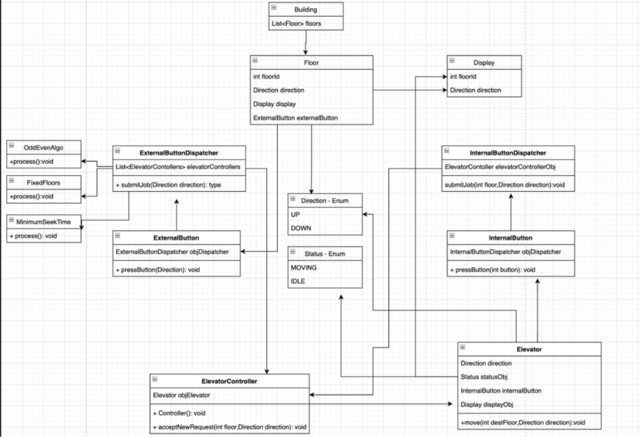
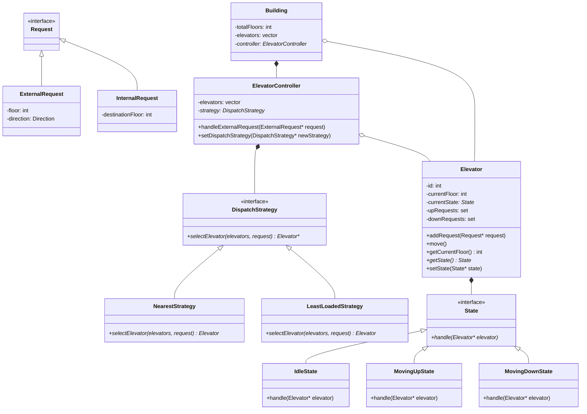

# Elevator System Design Pattern

This directory contains a low-level design (LLD) implementation for a multi-elevator system in a building, written in C++.

## Core Design Elements

- **Request Models**:
  - `Request` (Base class)
  - `ExternalRequest`: Triggered from outside the elevator (hall call specifying floor and direction).
  - `InternalRequest`: Triggered inside the elevator (cab call specifying destination floor).
- **State Pattern**:
  - Elevator transitions smoothly between states:
    - `IdleState`: Elevator is stationary.
    - `MovingUpState`: Elevator is traversing upwards.
    - `MovingDownState`: Elevator is traversing downwards.
- **Strategy Pattern (Dispatching Strategy)**:
  - Supports pluggable scheduling strategies:
    - `NearestStrategy`: Selects the closest elevator to service the request.
    - `LeastLoadedStrategy`: Selects the elevator with the minimum pending load/requests.
- **Controller & Building Layout**:
  - `ElevatorController`: Manages state and dispatches requests.
  - `Building`: Represents the structural envelope housing floors and elevator units.

## Class Diagram Overview



### Mermaid Class Diagram



## How to Run

To compile and run this implementation:
```bash
# Navigate to the ElevatorDesignPattern folder
cd ElevatorDesignPattern

# Compile the code
g++ -std=c++11 code.cpp -o elevator_design

# Run the executable
./elevator_design
```
