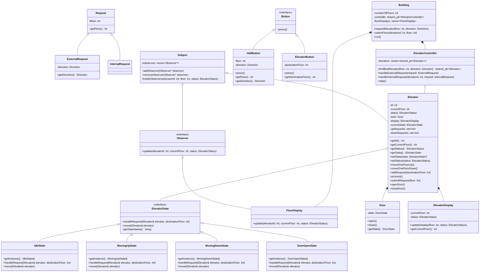

# Elevator System Design Pattern

This directory contains a low-level design (LLD) implementation for a multi-elevator system in a building, written in C++.

## Core Design Elements

- **Request Models**:
  - `Request` (Base class): Holds target floor.
  - `ExternalRequest`: Triggered from outside the elevator (hall call specifying floor and direction).
  - `InternalRequest`: Triggered inside the elevator (cab call specifying destination floor).
- **State Pattern**:
  - Elevator transitions between distinct states implemented as singletons:
    - `IdleState`: Elevator is stationary and idle.
    - `MovingUpState`: Elevator is moving upwards.
    - `MovingDownState`: Elevator is moving downwards.
    - `DoorOpenState`: Elevator doors are open for passengers.
- **Observer Pattern**:
  - Decoupled notification system to push state updates (floor level, direction, moving state) to:
    - `FloorDisplay` (Observer): Subscribes to elevator updates to display positions outside on building floors.
- **Display System**:
  - `ElevatorDisplay`: Integrated inside each elevator car to show status directly to passengers.
- **Button System**:
  - Extensible button components mapping physical interactions:
    - `HallButton` placed on building floors.
    - `ElevatorButton` inside elevator cabins.
- **Controller Dispatch Strategy**:
  - Built-in nearest-elevator assignment based on absolute distance to the requested floor.
- **Building Layout**:
  - `ElevatorController`: Manages and dispatches internal and external requests to the correct elevator.
  - `Building`: Represents the structural envelope housing floors, elevator units, and hall displays.

## Class Diagram Overview


### Mermaid Class Diagram



## How to Run

To compile and run this implementation:
```bash
# Navigate to the ElevatorDesignPattern folder
cd ElevatorDesignPattern

# Compile the code
g++ -std=c++17 code.cpp -o elevator_design

# Run the executable
./elevator_design
```
