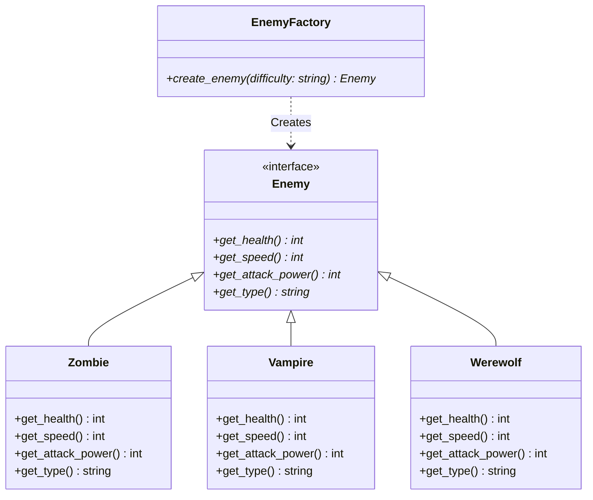

# Enemy Spawner Design Pattern

This directory contains a low-level design (LLD) implementation for an dynamic Enemy Spawner system, written in C++. It demonstrates the use of the **Factory Method / Simple Factory** design pattern to dynamically instantiate game enemies based on input parameters (difficulty level).

## Core Design Elements

- **Enemy Interface (`Enemy`)**:
  - Defines the common contract for all game enemies.
  - Exposes pure virtual methods for character attributes:
    - `get_health()`: Returns the maximum health points.
    - `get_speed()`: Returns the movement speed.
    - `get_attack_power()`: Returns the base damage.
    - `get_type()`: Returns the string representation of the enemy type.

- **Concrete Enemies**:
  - `Zombie`: Weak, slow enemy with medium health. (Health: 50, Speed: 2, Attack: 10)
  - `Vampire`: Faster, medium enemy with higher attack power. (Health: 30, Speed: 4, Attack: 15)
  - `Werewolf`: Strong, fast boss-like enemy with high stats. (Health: 80, Speed: 6, Attack: 25)

- **Factory Pattern (`EnemyFactory`)**:
  - `EnemyFactory` class encapsulates the creation logic of enemies.
  - The client passes a difficulty string (`"Easy"`, `"Medium"`, `"Hard"`) to the factory.
  - The factory determines the appropriate class to instantiate, hiding the concrete implementation from the client code.

## Class Diagram Overview



## How to Run

To compile and run this implementation:

```bash
# Navigate to the EnemySpawner folder
cd EnemySpawner

# Compile the code
g++ -std=c++11 code.cpp -o enemy_spawner

# Run the executable
./enemy_spawner
```

### Example Usage

The program expects an input difficulty (`Easy`, `Medium`, or `Hard`).

**Input:**
```text
Hard
```

**Output:**
```text
Enemy Type: Werewolf
Health: 80
Speed: 6, Attack Power: 25
```
