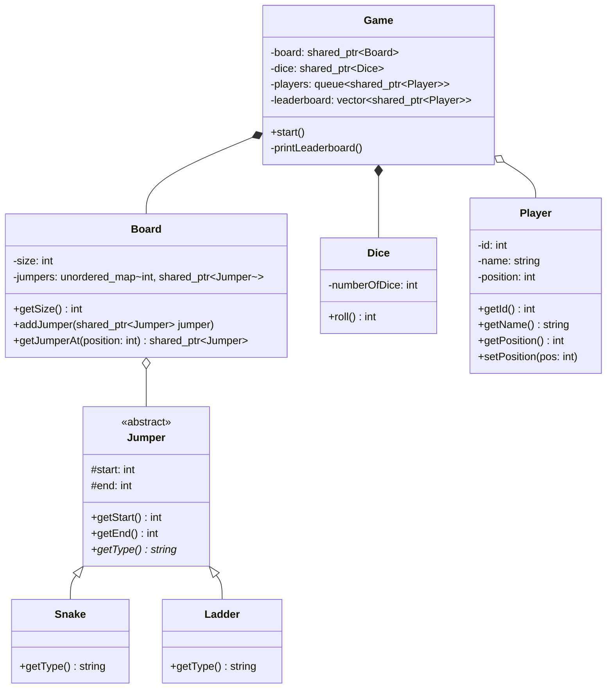

# Snake & Ladder Game Design Pattern

This directory contains a low-level design (LLD) implementation for a multiplayer Snake and Ladder board game, written in C++. It demonstrates clean object-oriented concepts like inheritance, polymorphism, encapsulation, and structural design.

## Core Design Elements

- **Jumper Base Class (`Jumper`)**:
  - Acts as a polymorphic base class representing any board element that alters a player's position.
  - Contains starting and ending coordinates.
  - Subclasses:
    - `Snake`: Represents a snake where `start > end`.
    - `Ladder`: Represents a ladder where `start < end`.

- **Board (`Board`)**:
  - Manages the board cells and holds a mapping of cell indices to `Jumper` instances.
  - Checks if a cell contains a snake or ladder.

- **Dice (`Dice`)**:
  - Handles the rolling mechanism.
  - Can support customizable dice configurations (e.g., standard 6-sided dice, multiple dice).

- **Player (`Player`)**:
  - Represents a participant in the game.
  - Holds player ID, name, and current board cell position.

- **Game Controller (`Game`)**:
  - Controls the setup and the sequential turn logic using a Queue-based approach.
  - Resolves player movements, checks constraints (e.g., rolls that exceed the board size are skipped), applies snake/ladder changes, and tracks the leaderboard.

## Class Diagram Overview



## How to Run

To compile and run this implementation:

```bash
# Navigate to the SnakeLadderGame folder
cd SnakeLadderGame

# Compile the code
g++ -std=c++17 code.cpp -o snake_ladder

# Run the executable
./snake_ladder
```

### Example Simulation Output

```text
=========================================
   Snake and Ladder Game Initializing... 
=========================================
Board Size: 100
Players in Game: 3

[Turn] Alice rolled a 1. Move: 0 -> 1
[Turn] Bob rolled a 5. Move: 0 -> 5
[Turn] Charlie rolled a 1. Move: 0 -> 1
...
[Turn] Bob rolled a 2. Move: 98 -> 100
🏆 Bob has reached the destination and won!
...
=========================================
               Leaderboard               
=========================================
1. Bob 🥇
2. Charlie
3. Alice
=========================================
```
