# Splitwise Low-Level System Design (LLD)

This directory contains a low-level design (LLD) implementation of an expense-sharing application similar to Splitwise, written in C++. The design utilizes multiple object-oriented design patterns to create a clean, modular, and extensible architecture. It includes advanced features such as transaction/debt minimization, real-time activity notifications, and flexible expense-splitting strategies.

## Core Features

- **User Management**: Create user profiles and track individual balances.
- **Group Management**: Create groups, add/remove members, and maintain group-specific expense sheets.
- **Flexible Expense Splitting**: Supports splitting expenses with three models:
  - **Equal Split**: Divides the total cost equally among all involved users.
  - **Exact Split**: Splits expenses using specific exact amounts for each user.
  - **Percentage Split**: Splits expenses by defining user-specific percentage shares.
- **Debt Simplification**: Implements a greedy algorithm (`DebtSimplifier`) that minimizes the number of transactions required to settle balances within a group, converting a complex web of mutual debts into a minimal set of direct transactions.
- **Settlement Actions**: Supports settling debts inside groups or individually, automatically updating balances and removing fully settled user pairs.
- **Safety Constraints**: Users cannot leave a group if they have outstanding debts or are owed money by others in the group.
- **Activity Feed / Notification System**: Real-time notifications dispatched to group members whenever a new expense is added or a settlement is recorded.

---

## Design Patterns Used

1. **Observer Pattern**:
   - `Observer` defines the interface for receiving updates.
   - `User` acts as a concrete observer.
   - `Group` acts as the concrete observable. When an expense is added or settled, all group members are notified instantly.
2. **Strategy Pattern**:
   - `SplitStrategy` defines the interface for calculating user splits.
   - `EqualSplit`, `ExactSplit`, and `PercentageSplit` provide specific split calculation implementations.
3. **Factory Method Pattern**:
   - `SplitFactory` instantiates the appropriate `SplitStrategy` dynamically based on the requested `SplitType`.
4. **Singleton Pattern**:
   - `Splitwise` uses a singleton instance to manage the global state of users, groups, and expenses.
5. **Facade Pattern**:
   - `Splitwise` acts as a facade, exposing high-level user-friendly APIs for creating users/groups, splitting expenses, and checking balances, while shielding the client from underlying object relationships.

---

## Class Diagram Overview

### UML Diagram Reference
For a visual view of the relationships and classes, check out the [Splitwise UML Diagram](./SplitwiseUML.png).

### Mermaid Class Diagram

```mermaid
classDiagram
    class SplitType {
        <<enumeration>>
        EQUAL
        EXACT
        PERCENTAGE
    }
    
    class Split {
        +userId: string
        +amount: double
        +Split(userId: string, amount: double)
    }
    
    class Observer {
        <<interface>>
        +update(message: string)* void
    }
    
    class User {
        +userId: string
        +name: string
        +email: string
        +balances: map~string, double~
        +update(message: string) void
        +updateBalance(otherUserId: string, amount: double) void
        +getTotalOwed() double
        +getTotalOwing() double
    }
    Observer <|-- User
    
    class SplitStrategy {
        <<interface>>
        +calculateSplit(totalAmount: double, userIds: vector~string~, values: vector~double~)* vector~Split~
    }
    
    class EqualSplit {
        +calculateSplit(totalAmount: double, userIds: vector~string~, values: vector~double~) vector~Split~
    }
    
    class ExactSplit {
        +calculateSplit(totalAmount: double, userIds: vector~string~, values: vector~double~) vector~Split~
    }
    
    class PercentageSplit {
        +calculateSplit(totalAmount: double, userIds: vector~string~, values: vector~double~) vector~Split~
    }
    
    SplitStrategy <|-- EqualSplit
    SplitStrategy <|-- ExactSplit
    SplitStrategy <|-- PercentageSplit
    
    class SplitFactory {
        +getSplitStrategy(type: SplitType) SplitStrategy*
    }
    SplitFactory ..> SplitStrategy : Creates
    
    class Expense {
        +expenseId: string
        +description: string
        +totalAmount: double
        +paidByUserId: string
        +splits: vector~Split~
        +groupId: string
        +Expense(desc: string, amount: double, paidBy: string, splits: vector~Split~&, group: string)
    }
    Expense *-- Split
    
    class DebtSimplifier {
        +simplifyDebts(groupBalances: map~string, map~string, double~~) map~string, map~string, double~~$
    }
    
    class Group {
        +groupId: string
        +name: string
        +members: vector~User*~
        +groupExpenses: map~string, Expense*~
        +groupBalances: map~string, map~string, double~~
        +addMember(user: User*) void
        +removeMember(userId: string) bool
        +notifyMembers(message: string) void
        +isMember(userId: string) bool
        +updateGroupBalance(fromUserId: string, toUserId: string, amount: double) void
        +canUserLeaveGroup(userId: string) bool
        +getUserGroupBalances(userId: string) map~string, double~
        +addExpense(description: string&, amount: double, paidByUserId: string&, involvedUsers: vector~string~&, splitType: SplitType, splitValues: vector~double~&) bool
        +settlePayment(fromUserId: string&, toUserId: string&, amount: double) bool
        +showGroupBalances() void
        +simplifyGroupDebts() void
    }
    Group o-- User
    Group *-- Expense
    Group ..> DebtSimplifier : Uses
    
    class Splitwise {
        -users: map~string, User*~
        -groups: map~string, Group*~
        -expenses: map~string, Expense*~
        -instance: Splitwise*
        +getInstance() Splitwise*$
        +createUser(name: string, email: string) User*
        +getUser(userId: string) User*
        +createGroup(name: string) Group*
        +getGroup(groupId: string) Group*
        +addUserToGroup(userId: string, groupId: string) void
        +removeUserFromGroup(userId: string, groupId: string) bool
        +addExpenseToGroup(groupId: string&, description: string, amount: double, paidByUserId: string&, involvedUsers: vector~string~&, splitType: SplitType, splitValues: vector~double~&) void
        +settlePaymentInGroup(groupId: string&, fromUserId: string&, toUserId: string&, amount: double) void
        +settleIndividualPayment(fromUserId: string, toUserId: string, amount: double) void
        +addIndividualExpense(description: string, amount: double, paidByUserId: string, toUserId: string, splitType: SplitType, splitValues: vector~double~&) void
        +showUserBalance(userId: string&) void
        +showGroupBalances(groupId: string&) void
        +simplifyGroupDebts(groupId: string&) void
    }
    Splitwise o-- User
    Splitwise o-- Group
    Splitwise o-- Expense
```



---

## How to Run

To compile and run this implementation:

```bash
# Navigate to the SplitwisedDesignPattern folder
cd SplitwisedDesignPattern

# Compile the C++ code
g++ -std=c++11 code.cpp -o splitwise_design

# Run the executable
./splitwise_design
```

---

## Example Walkthrough Output

When executed, the program runs a comprehensive demo demonstrating:
1. Creating four users: Aditya, Rohit, Manish, and Saurav.
2. Forming the "Hostel Expenses" group.
3. Adding a group expense split **equally** (Rs 800 lunch paid by Aditya).
4. Adding an **exact** group expense (Rs 700 dinner paid by Manish with exact shares of Rs 200 for Aditya, Rs 300 for Manish, and Rs 200 for Saurav).
5. Showing group balances, which initially contain multiple bilateral debts.
6. Triggering **Debt Simplification** to run the greedy settlement minimizer.
7. Printing simplified group balances showing reduced transaction paths.
8. Trying to remove Rohit from the group, which fails since Rohit has a debt of Rs 200.
9. Recording a settlement transaction where Rohit pays Manish Rs 200, followed by successfully removing Rohit from the group.

```text
=========== Creating Users ====================
User created: Aditya (ID: user1)
User created: Rohit (ID: user2)
User created: Manish (ID: user3)
User created: Saurav (ID: user4)

=========== Creating Group and Adding Members ====================
Group created: Hostel Expenses (ID: group1)
Aditya added to group Hostel Expenses
Rohit added to group Hostel Expenses
Manish added to group Hostel Expenses
Saurav added to group Hostel Expenses

=========== Adding Expenses in group ====================

=========== Sending Notifications ====================
[NOTIFICATION to Aditya]: New expense added: Lunch (Rs 800.000000)
[NOTIFICATION to Rohit]: New expense added: Lunch (Rs 800.000000)
[NOTIFICATION to Manish]: New expense added: Lunch (Rs 800.000000)
[NOTIFICATION to Saurav]: New expense added: Lunch (Rs 800.000000)

=========== Expense Message ====================
Expense added to Hostel Expenses: Lunch (Rs 800) paid by Aditya and involved people are : 
Aditya, Rohit, Manish, Saurav, 
Will be Paid Equally

=========== Sending Notifications ====================
[NOTIFICATION to Aditya]: New expense added: Dinner (Rs 700.000000)
[NOTIFICATION to Rohit]: New expense added: Dinner (Rs 700.000000)
[NOTIFICATION to Manish]: New expense added: Dinner (Rs 700.000000)
[NOTIFICATION to Saurav]: New expense added: Dinner (Rs 700.000000)

=========== Expense Message ====================
Expense added to Hostel Expenses: Dinner (Rs 700) paid by Manish and involved people are : 
Aditya : 200
Manish : 300
Saurav : 200

=========== printing Group-Specific Balances ====================

=== Group Balances for Hostel Expenses ===
Aditya's balances in group:
  Rohit owes: Rs 200.00
  Saurav owes: Rs 200.00
Rohit's balances in group:
  Owes Aditya: Rs 200.00
Manish's balances in group:
  Saurav owes: Rs 200.00
Saurav's balances in group:
  Owes Aditya: Rs 200.00
  Owes Manish: Rs 200.00

=========== Debt Simplification ====================

Debts have been simplified for group: Hostel Expenses

=========== printing Group-Specific Balances ====================

=== Group Balances for Hostel Expenses ===
Aditya's balances in group:
  Saurav owes: Rs 400.00
Rohit's balances in group:
  Owes Manish: Rs 200.00
Manish's balances in group:
  Rohit owes: Rs 200.00
Saurav's balances in group:
  Owes Aditya: Rs 400.00

=========== Adding Individual Expense ====================
Individual expense added: Coffee (Rs 40.00) paid by Rohit for Saurav

=========== printing User Balances ====================

=========== Balance for Aditya ====================
Total you owe: Rs 0.00
Total others owe you: Rs 0.00
Detailed balances:

=========== Balance for Rohit ====================
Total you owe: Rs 0.00
Total others owe you: Rs 40.00
Detailed balances:
  Saurav owes you: Rs40.00

=========== Balance for Manish ====================
Total you owe: Rs 0.00
Total others owe you: Rs 0.00
Detailed balances:

=========== Balance for Saurav ====================
Total you owe: Rs 40.00
Total others owe you: Rs 0.00
Detailed balances:
  You owe Rohit: Rs40.00

==========Attempting to remove Rohit from group==========

User not allowed to leave group without clearing expenses

======== Making Settlement to Clear Rohit's Debt ==========
[NOTIFICATION to Aditya]: Settlement: Rohit paid Manish Rs 200.000000
[NOTIFICATION to Rohit]: Settlement: Rohit paid Manish Rs 200.000000
[NOTIFICATION to Manish]: Settlement: Rohit paid Manish Rs 200.000000
[NOTIFICATION to Saurav]: Settlement: Rohit paid Manish Rs 200.000000
Settlement in Hostel Expenses: Rohit settled Rs 200.00 with Manish

======== Attempting to Remove Rohit Again ==========
Rohit successfully left Hostel Expenses

=========== Updated Group Balances ====================

=== Group Balances for Hostel Expenses ===
Aditya's balances in group:
  Saurav owes: Rs 400.00
Manish's balances in group:
  No outstanding balances
Saurav's balances in group:
  Owes Aditya: Rs 400.00
```
