# Tinder Low-Level System Design (LLD)

This directory contains a low-level design (LLD) implementation of a Tinder-like dating application, written in C++. It demonstrates how to use several object-oriented design patterns to build a clean, decoupled, and extensible matchmaking and communication platform.

## Core Features

- **Profile Management**: Support for user profiles containing name, age, gender (Male, Female, Non-Binary, Other), biography, photos, structured interests (categorized), and geographical locations.
- **Preference Configurations**: Customizable preferences for age range, maximum distance radius, and targeted genders.
- **Swipe System**: Swipe actions (`SwipeAction::LEFT` for dislike, `SwipeAction::RIGHT` for like) with history tracking.
- **Matchmaking Engine**: Matches are generated instantly when two users swipe right on each other.
- **Location Service**: Geolocation calculations using the **Haversine formula** to measure distances in kilometers between user coordinates.
- **Chat & Messaging System**: Automatically opens a chat room when a match is created, allowing users to send messages and keep track of timestamps.
- **Notification System**: Triggers instant push-like notifications when a user gets a new match or receives a message.

## Design Patterns Used

1. **Facade Pattern (`DatingApp`)**:
   - Acts as a entry point to the system, coordinating the interaction between the User System, Location Service, Matching System, Chat Rooms, and Notification System.
2. **Singleton Pattern (`DatingApp`, `LocationService`, `NotificationService`)**:
   - Ensures that only a single instance of these coordinator services exists throughout the life of the application.
3. **Observer Pattern (`NotificationService`, `NotificationObserver`, `UserNotificationObserver`)**:
   - Decoupled real-time updates. When a match occurs or a message is sent, the `NotificationService` notifies the respective users via their registered `UserNotificationObserver`.
4. **Strategy Pattern (`LocationService`, `LocationStrategy`, `BasicLocationStrategy`)**:
   - Dynamically selects location search logic. The system uses a strategy interface to fetch nearby users, making it easy to swap the current distance calculation with quadtree or geospatial indexing algorithms.
5. **Factory Method Pattern (`MatcherFactory`, `Matcher`)**:
   - Creates the matching scoring engine (`BasicMatcher`, `InterestsBasedMatcher`, or `LocationBasedMatcher`) dynamically based on user/system preferences.

---

## Class Diagram Overview

### UML Diagram Reference
For a detailed graphic view of the relationships, check out the [Tinder UML Diagram](./TinderUML.png).

### Mermaid Class Diagram

```mermaid
classDiagram
    class Gender {
        <<enumeration>>
        MALE
        FEMALE
        NON_BINARY
        OTHER
    }
    class SwipeAction {
        <<enumeration>>
        LEFT
        RIGHT
    }
    class MatcherType {
        <<enumeration>>
        BASIC
        INTERESTS_BASED
        LOCATION_BASED
    }
    
    class Location {
        -latitude: double
        -longitude: double
        +distanceInKm(other: Location) double
    }
    
    class Interest {
        -name: string
        -category: string
    }
    
    class Preference {
        -interestedIn: vector~Gender~
        -minAge: int
        -maxAge: int
        -maxDistance: double
        -interests: vector~string~
        +isInterestedInGender(gender: Gender) bool
        +isAgeInRange(age: int) bool
        +isDistanceAcceptable(distance: double) bool
    }
    
    class Message {
        -senderId: string
        -content: string
        -timestamp: time_t
        +getFormattedTime() string
    }
    
    class ChatRoom {
        -id: string
        -participantIds: vector~string~
        -messages: vector~Message*~
        +addMessage(senderId: string, content: string)
        +displayChat()
    }
    ChatRoom *-- Message
    
    class UserProfile {
        -name: string
        -age: int
        -gender: Gender
        -bio: string
        -photos: vector~string~
        -interests: vector~Interest*~
        -location: Location
        +display()
    }
    UserProfile *-- Location
    UserProfile o-- Interest
    UserProfile o-- Gender
    
    class NotificationObserver {
        <<interface>>
        +update(message: string)*
    }
    class UserNotificationObserver {
        -userId: string
        +update(message: string)
    }
    NotificationObserver <|-- UserNotificationObserver
    
    class NotificationService {
        -observers: map~string, NotificationObserver*~
        -instance: NotificationService*
        +getInstance() NotificationService*
        +registerObserver(userId: string, observer: NotificationObserver*)
        +removeObserver(userId: string)
        +notifyUser(userId: string, message: string)
    }
    NotificationService o-- NotificationObserver
    
    class LocationStrategy {
        <<interface>>
        +findNearbyUsers(location: Location, maxDistance: double, allUsers: vector~User*~)* vector~User*~
    }
    class BasicLocationStrategy {
        +findNearbyUsers(location: Location, maxDistance: double, allUsers: vector~User*~) vector~User*~
    }
    LocationStrategy <|-- BasicLocationStrategy
    
    class LocationService {
        -strategy: LocationStrategy*
        -instance: LocationService*
        +getInstance() LocationService*
        +setStrategy(newStrategy: LocationStrategy*)
        +findNearbyUsers(location: Location, maxDistance: double, allUsers: vector~User*~) vector~User*~
    }
    LocationService o-- LocationStrategy
    
    class Matcher {
        <<interface>>
        +calculateMatchScore(user1: User*, user2: User*)* double
    }
    class BasicMatcher {
        +calculateMatchScore(user1: User*, user2: User*) double
    }
    class InterestsBasedMatcher {
        +calculateMatchScore(user1: User*, user2: User*) double
    }
    class LocationBasedMatcher {
        +calculateMatchScore(user1: User*, user2: User*) double
    }
    Matcher <|-- BasicMatcher
    Matcher <|-- InterestsBasedMatcher
    Matcher <|-- LocationBasedMatcher
    
    class MatcherFactory {
        +createMatcher(type: MatcherType) Matcher*
    }
    MatcherFactory ..> Matcher : Creates
    
    class User {
        -id: string
        -profile: UserProfile*
        -preference: Preference*
        -swipeHistory: map~string, SwipeAction~
        -notificationObserver: NotificationObserver*
        +swipe(otherUserId: string, action: SwipeAction)
        +hasLiked(otherUserId: string) bool
        +hasDisliked(otherUserId: string) bool
        +hasInteractedWith(otherUserId: string) bool
    }
    User *-- UserProfile
    User *-- Preference
    User o-- SwipeAction
    User o-- NotificationObserver
    
    class DatingApp {
        -users: vector~User*~
        -chatRooms: vector~ChatRoom*~
        -matcher: Matcher*
        -instance: DatingApp*
        +getInstance() DatingApp*
        +setMatcher(type: MatcherType)
        +createUser(userId: string) User*
        +findNearbyUsers(userId: string, maxDistance: double) vector~User*~
        +swipe(userId: string, targetUserId: string, action: SwipeAction) bool
        +sendMessage(senderId: string, receiverId: string, content: string)
    }
    DatingApp o-- User
    DatingApp o-- ChatRoom
    DatingApp o-- Matcher
```



---

## How to Run

To compile and run this implementation:

```bash
# Navigate to the TinderDesign folder
cd TinderDesign

# Compile the code
g++ -std=c++11 code.cpp -o tinder_design

# Run the executable
./tinder_design
```

### Example Walkthrough Output

When run, the program demonstrates:
1. Creating user profiles for Rohan and Neha with location details.
2. Proximity check (`findNearbyUsers`) where Rohan finds Neha within 5km.
3. Bidirectional swipes to form a match.
4. Sending messages via the chat system and printing the updated history.

```text
---- User Profiles ----
===== Profile =====
Name: Rohan
Age: 28
Gender: Male
Bio: I am a software developer
Photos: rohan_photo1.jpg, 
Interests: Coding (Programming), Travel (Lifestyle), Music (Entertainment), 
Location: 1.01, 1.02
===================
===== Profile =====
Name: Neha
Age: 27
Gender: Female
Bio: Art teacher who loves painting and traveling.
Photos: neha_photo1.jpg, 
Interests: Painting (Art), Travel (Lifestyle), Music (Entertainment), 
Location: 1.03, 1.04
===================

---- Nearby Users for user1 (within 5km) ----
Found 1 nearby users
- Neha (user2)

---- Swipe Actions ----
User1 swipes right on User2
User2 swipes right on User1
Notification for user user2: You have a new match with Rohan!
Notification for user user1: You have a new match with Neha!

---- Chat Room ----
Notification for user user2: New message from Rohan
Notification for user user1: New message from Neha
===== Chat Room: user1_user2 =====
[2026-07-14 23:30:11] user1: Hi Neha, Kaise ho?
[2026-07-14 23:30:11] user2: Hi Rohan, Ma bdiya tum btao
=========================
```
